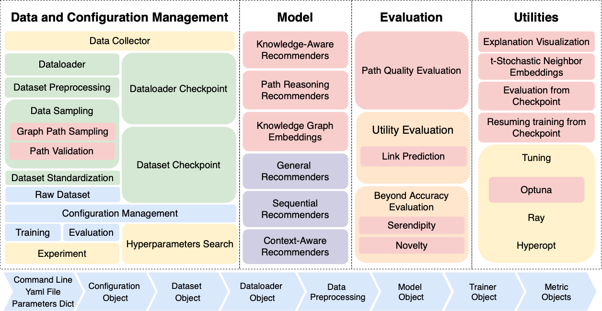
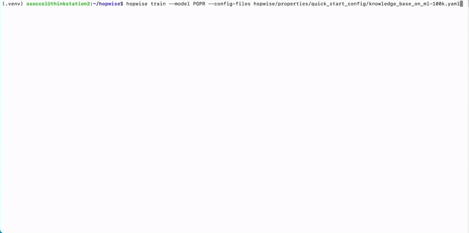
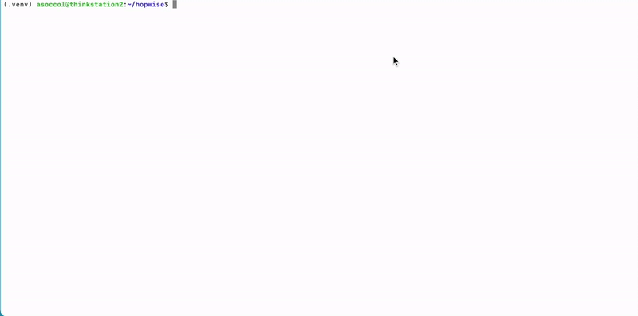
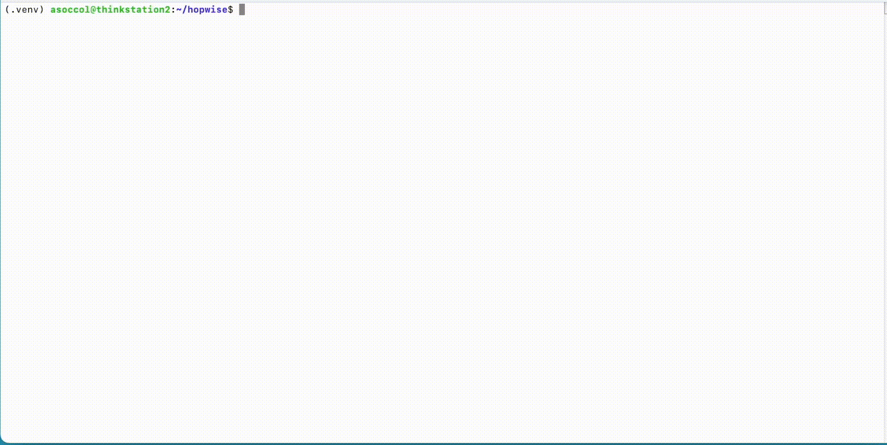

<h1 align="center">🚀 hopwise</h1>
<p align="center">
  <b>RecBole extension with a focus on Knowledge Graphs (KGs) and explainability.</b>
</p>
<p align="center">
  
  
  
  <a href="https://github.com/tail-unica/hopwise/network"></a>
<a href="https://github.com/tail-unica/hopwise/stargazers"></a>
</p>


---

## ✨ Overview

**hopwise** is an advanced extension of the RecBole library, designed to enhance recommendation systems with the power of **knowledge graphs**.
By integrating **knowledge embedding models**, **path-based reasoning methods**, and **path language modeling approaches**, hopwise supports both **recommendation** and **link prediction** tasks with a focus on **explainability**.

---



**Our framework: <span style="color:rgb(247, 206, 204)">new functionalities</span>, <span style="color:rgb(213, 232, 212)">datasets utilities</span>, <span style="color:rgb(218, 232, 249)">abstraction layers</span>, <span style="color:rgb(255, 242, 205)">environment utils</span>, <span style="color:rgb(255, 230, 205)">metrics type</span>, <span style="color:rgb(208,206,226)">models</span>**

## 🆕 What's New?

🆕 **Path Reasoning Models**
- **[PLM-Rec](https://dl.acm.org/doi/10.1145/3485447.3511937)**
- **[PEARLM](https://arxiv.org/pdf/2310.16452)**
- **[KGGLM](https://dl.acm.org/doi/10.1145/3640457.3691703)**
- **[PGPR](https://dl.acm.org/doi/10.1145/3331184.3331203)**
- **[CAFE](https://dl.acm.org/doi/10.1145/3340531.3412038)**
- **[TPRec](https://dl.acm.org/doi/10.1145/3531267)**

*We also added [KGLRR](https://link.springer.com/article/10.1007/s10994-024-06646-4) although the final explanation is not based on a predicted path in a Knowledge Graph.*

🆕 **Knowledge Graph Embedding Models**

**📌 Translational Models**

- **[TransE](https://proceedings.neurips.cc/paper_files/paper/2013/file/1cecc7a77928ca8133fa24680a88d2f9-Paper.pdf)**

- **[TransH](https://ojs.aaai.org/index.php/AAAI/article/view/8870)**

- **[TransD](https://aclanthology.org/P15-1067/)**

- **[TransR](https://linyankai.github.io/publications/aaai2015_transr.pdf)**

- **[TorusE](https://cdn.aaai.org/ojs/11538/11538-13-15066-1-2-20201228.pdf)**
- **[RotatE](https://arxiv.org/abs/1902.10197)**

**📌 Tensor/Matrix Factorization Models**


- **[ComplEx](https://arxiv.org/abs/1606.06357)**

- **[Analogy](https://proceedings.mlr.press/v70/liu17d/liu17d.pdf)**

- **[TuckER](https://arxiv.org/abs/1901.09590)**

- **[RESCAL](https://icml.cc/2011/papers/438_icmlpaper.pdf)**

- **[DistMult](https://arxiv.org/abs/1412.6575)**

- **[HolE](https://arxiv.org/abs/1510.04935)**

**📌 Convolution-Based Models**

- **[ConvE](https://arxiv.org/abs/1707.01476)**

- **[ConvKB](https://aclanthology.org/N18-2053/)**


*We relied for most of the Knowledge Graph Embeddings methods to: [TorchKGE](https://torchkge.readthedocs.io/en/latest/) due to its popularity, published at a KDD workshop in 2022*x

🆕 **Explanation Path Quality Metrics**

- **LIR (Linking Interaction Recency)**
- **SEP (Shared Entity Popularity)**
- **LID (Linking Interaction Diversity)**
- **LITD (Linked Interaction Type Diversity)**
- **SED (Shared Entity Diversity)**
- **SETD (Shared Entities Type Diversity)**
- **PTC (Path Type Concentration)**
- **PPT (Path Pattern Type)**
- **PTD/PPC (Path Type Diversity)**
- **Model Fidelity**

> [!IMPORTANT]
> **Check the paper for the other changes.**

## ⚡ Installation

To install the project, you need to use `uv`. Follow the steps below to set up the environment and install the necessary dependencies.

## 🔹 Prerequisites
- ✅ Python **3.9**, **3.10**, or **3.11**
- ✅ [`uv`](https://github.com/astral-sh/uv) package manager

---

### 🔹 Steps (from PyPI or from Source)


1️⃣ **Install **uv** and create a virtual environment.**<br>

We suggest installing **uv** as a [standalone application](https://docs.astral.sh/uv/getting-started/installation/#standalone-installer) instead of using pip to avoid issues and let **uv** create a dedicated virtual environment.<br>
Once installed, create the virtual environment

```sh
uv venv --python PYTHON_VERSION --prompt hopwise
```
`PYTHON_VERSION` must be one of 3.9, 3.10, 3.11, while `--prompt hopwise` customizes the virtual environment name that appears on the shell.

2️⃣ **Install via PyPI**

```sh
pip install hopwise
```

**🎉 Done 🎉**

---

2️⃣ **Install from source: Clone the repository**
```sh
git clone https://github.com/tail-unica/hopwise.git
cd hopwise
```


3️⃣ Install project dependencies


*make sure to have uv updated to the latest version*

```sh
uv sync
```
Some models require extra dependencies.
Check out pyproject.toml for optional dependencies.
For example, to install NNCF:
```sh
uv sync --extra nncf
```

> 📢 **Windows:** For proper DGL installation, please follow the [official DGL installation guide](https://www.dgl.ai/pages/start.html). Windows builds may encounter DLL linking issues with standard installation methods. Pre-built packages from the official source are recommended. Otherwise, using the Windows Subsystem for Linux (WSL) might be feasible as a solution.

**🎉 Done 🎉**

## 🚀 Usage
In any chosen setup, a .yaml file must be created containing the configuration to be used. An example:
```yaml
gpu_id: 0
topk: [10,20,50,...]
data_path: *your_datasets_folder*
metrics: ['NDCG', 'MRR', 'Hit', 'Precision', 'Recall',...]
valid_metric: ndcg@10
eval_batch_size: 1
epochs: 1
eval_step: 1
```

### 📍 Training




Run the project with the following command:
```sh
hopwise train --model MODEL --dataset DATASET \
--config_files CONF_FILE_1.yaml CONF_FILE_2.yaml
```

Override config parameters directly from the CLI using =:
```sh
hopwise train --epochs=20
```

### 📍 Evaluating from Checkpoint


```sh
hopwise evaluate --dataset DATASET --model MODEL \
--config-files CONFIG_FILES --checkpoint CHECKPOINT.pth
```

### 📍 Hyperparameters Tuning

In addition to the configuration file, a params file with the extension *.hyper* the range of hyperparameters to be tested must also be set in this configuration

```yaml
learning_rate uniform 0.0001, 0.1
embedding_size choice [64, 100, 200]
```



```sh
hopwise tune --params-file hopwise/properties/hyper/PARAMS_FILE.hyper \
--config-files CONFIG_FILE.yaml --study-name STUDY_NAME
```

## ℹ️ Contributing
Please let us know if you encounter a bug or have any suggestions by filing an issue.

We welcome all contributions from bug fixes to new features and extensions. 🚀

We expect all contributions discussed in the issue tracker and going through PRs. 📌

## 📜 Cite
If you find **hopwise** useful for your research or development, please cite with:

```bibtex
the paper is under revision
```

## The Team

[Ludovico Boratto](https://www.ludovicoboratto.com/), [Gianni Fenu](https://web.unica.it/unica/it/ateneo_s07_ss01.page?contentId=SHD30371), [Mirko Marras](https://www.mirkomarras.com/), [Giacomo Medda](https://jackmedda.github.io/), [Alessandro Soccol](https://alessandrosocc.github.io)


## License
This project is licensed under the MIT License. See the LICENSE file for details.

