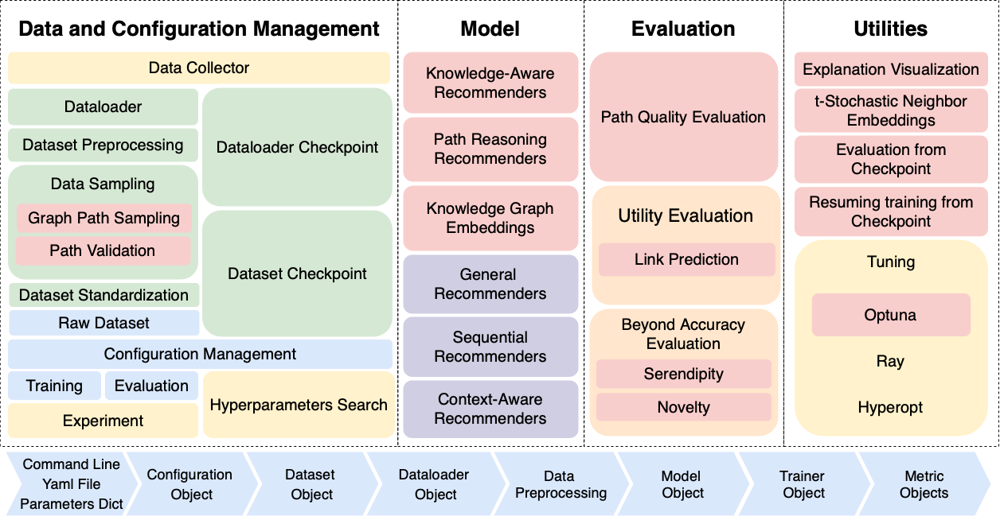

Introduction
======================

hopwise
----------------------

hopwise is an advanced extension of the **RecBole** library, designed to enhance recommendation systems with the power of knowledge graphs. By integrating knowledge embedding models, path-based reasoning methods, and path language modeling approaches, hopwise supports both recommendation and link prediction tasks with a focus on explainability.

**It aims to help the researchers to reproduce and develop recommendation models.**

In the lastest release, our library includes all the algorithms already present in Recbole `[Model List]`_, along with two 🆕 new categories of models and numerous other improvements:

- General Recommendation
- Sequential Recommendation
- Context-aware Recommendation
- Knowledge-based Recommendation
- Path Reasoning based Recommendation
- Knowledge Graph Embeddings for Recommendation and Link prediction

We have also added 4 new datasets in addition to the 44 datasets already available in Recbole `[Collected Datasets]`_.

New Features:

- We added 7 Path-Based (some of them from scratch)
- We added 14 knowledge graph embedding methods
- We added 4 new datasets
- We added 12 new metrics covering Beyond-Accuracy and Path-Quality Metrics
- We added the feature to evaluate from a checkpoint
- We added the support for Link Prediction along the recommendation task on KGE
- We added the support for optuna in hyperparameters hyper_tuning
- We added a new data sample feature to sample paths from a knowledge graph
   We also covered the saving of different dataloaders so you don't need to sample each time new paths
- We added support for uv
- We added support for embeddings visualization through tSNE
   We also prepared a case study to show how to use it inside run_example folder

.. _[Collected Datasets]:
    /dataset_list.html

.. _[Model List]:
    /model_list.html

.. toctree::
   :maxdepth: 1
   :caption: Get Started

   get_started/install
   get_started/distributed_training
   get_started/data_intro

.. toctree::
   :maxdepth: 1
   :caption: User Guide

   user_guide/usage

   user_guide/configuration
   user_guide/datasets

   user_guide/general_recommendation
   user_guide/context_aware_recommendation
   user_guide/sequential_recommendation
   user_guide/knowledge_based_recommendation
   user_guide/path_reasoning_recommendation
   user_guide/knowledge_graph_embeddings

   user_guide/training_and_evaluation
   user_guide/hyperparameters_tuning

.. toctree::
   :maxdepth: 1
   :caption: Architecture

   developer_guide/change_configuration
   developer_guide/create_datasets
   developer_guide/create_samplers
   developer_guide/create_dataloaders
   developer_guide/create_trainers
   developer_guide/create_models
   developer_guide/create_metrics

The Team
------------------
hopwise is developed and maintained by the **`Trustworthy Artificial Intelligence Laboratory @ University of Cagliari`**.

License
------------
hopwise uses `MIT License <https://github.com/tail-unica/hopwise/blob/main/LICENSE>`.